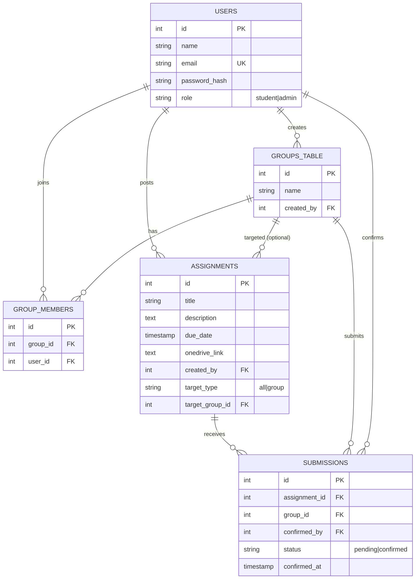

# Joineazy — Student, Group & Assignment Management System

A role-based full-stack web application where students form groups, manage members, and confirm
assignment submissions, while professors (admins) post assignments and track group-wise progress.

## Tech Stack

- **Frontend:** React.js (Vite), Tailwind CSS, React Router, Axios
- **Backend:** Node.js, Express.js
- **Database:** PostgreSQL
- **Auth:** JWT (role-based: student / admin)
- **Containerization:** Docker & Docker Compose

## Architecture Overview

```
┌─────────────┐        REST/JSON (JWT)        ┌──────────────┐        SQL         ┌────────────┐
│   React SPA │ ───────────────────────────▶  │  Express API │ ─────────────────▶ │ PostgreSQL │
│ (Tailwind)  │ ◀───────────────────────────  │  (Node.js)   │ ◀───────────────── │            │
└─────────────┘                               └──────────────┘                    └────────────┘
      │                                              │
      │ localStorage (JWT token)                     │ bcrypt password hashing
      │ Axios interceptor attaches                    │ jsonwebtoken for issuing/verifying tokens
      │ Authorization: Bearer <token>                 │ role middleware guards admin-only routes
```

- The **frontend** is a single-page app. `AuthContext` stores the logged-in user and token in
  `localStorage`; an Axios interceptor automatically attaches the JWT to every request.
- The **backend** exposes a REST API under `/api`. Routes are grouped by domain (auth, groups,
  assignments, submissions). `middleware/auth.js` verifies the JWT and enforces role checks
  (`requireRole('admin')`) on professor-only endpoints.
- The **database** is PostgreSQL, initialized from `backend/src/models/schema.sql` on first
  container start (mounted into `/docker-entrypoint-initdb.d`).

## Database Schema & Relationships (ER Diagram)



**Key relationships**

- A `user` (role=admin) creates many `assignments`; a `user` (role=student) creates a `group`.
- `group_members` is the join table resolving the many-to-many relationship between `users` and
  `groups_table`.
- An `assignment` can target `all` students or one specific `group` (`target_group_id`).
- `submissions` links a `group` to an `assignment` with a unique constraint
  (`assignment_id`, `group_id`) so a group has exactly one submission record per assignment —
  updated to `confirmed` via the two-step confirmation flow.

## Core Functional Scope

### Student
- Register / login.
- Create a group and add members by email.
- View all assignments.
- Open the OneDrive submission link.
- Confirm submission via two-step verification "Yes, I have submitted" → "Confirm".
- View group progress as a percentage progress bar (confirmed assignments / total assignments).

### Admin (Professor)
- Create assignments title, description, due date, OneDrive link, optionally targeted to a
  specific group.
- View all assignments and edit them.
- View per-assignment submission status broken down by group.
- View basic analytics like total groups vs. confirmed groups via `/assignments/:id/analytics`.

## API Endpoints

| Method | Endpoint | Role | Description |
|---|---|---|---|
| POST | `/api/auth/register` | Public | Register a student or admin |
| POST | `/api/auth/login` | Public | Login, returns JWT + user |
| POST | `/api/groups` | Student | Create a new group (creator auto-joins) |
| POST | `/api/groups/:groupId/members` | Student | Add a member by email |
| GET | `/api/groups` | Student/Admin | List own groups (student) or all groups (admin) |
| GET | `/api/groups/:groupId/members` | Any | List members of a group |
| POST | `/api/assignments` | Admin | Create an assignment |
| PUT | `/api/assignments/:id` | Admin | Edit an assignment |
| GET | `/api/assignments` | Student/Admin | List assignments relevant to the user |
| GET | `/api/assignments/:id/analytics` | Admin | Total vs. confirmed groups for an assignment |
| POST | `/api/submissions/confirm` | Student | Final step of two-step submission confirmation |
| GET | `/api/submissions/group/:groupId/progress` | Student | Group's completion percentage |
| GET | `/api/submissions/assignment/:assignmentId/status` | Admin | Per-group status for an assignment |

All routes except `/api/auth/*` require `Authorization: Bearer <JWT>`.

## Setup & Run Instructions

### Option A — Docker 

```bash
git clone <your-repo-url>
cd joineazy-task1
docker compose up --build
```

- Frontend: http://localhost:5173
- Backend API: http://localhost:5000/api
- PostgreSQL: localhost:5432 (user: `joineazy`, password: `joineazy_pass`, db: `joineazy_db`)

The schema in `backend/src/models/schema.sql` is auto-applied on the first Postgres container start.

### Option B — local dev

**Backend**
```bash
cd backend
cp .env.example .env  
npm install
psql -U postgres -f src/models/schema.sql 
npm run dev
```

**Frontend**
```bash
cd frontend
npm install
npm run dev
```

## Key Design & Deployment Decisions

- **Two-step confirmation** is implemented purely in the frontend UI state (`SubmissionConfirm.jsx`)
  to avoid accidental one-click submissions, then persisted via a single idempotent
  `POST /submissions/confirm` (upsert with `ON CONFLICT`).
- **Role-based access** is enforced server-side via middleware (`authenticate` + `requireRole`),
  not just hidden in the UI, so API calls are secured even if a client is tampered with.
- **Group-target vs. all-students assignments** are modeled with `target_type` and a nullable
  `target_group_id`, keeping a single `assignments` table instead of duplicating rows per group.
- **Idempotent submissions** use a unique `(assignment_id, group_id)` constraint with
  `ON CONFLICT DO UPDATE`, so re-confirming never creates duplicate rows.
- **Dockerized services** It allow the whole stack to be demoed with a
  single `docker compose up`, matching the assignment's deployment expectations.
- **Password security**: passwords are hashed with bcrypt before storage; JWTs expire after 2 days. 
